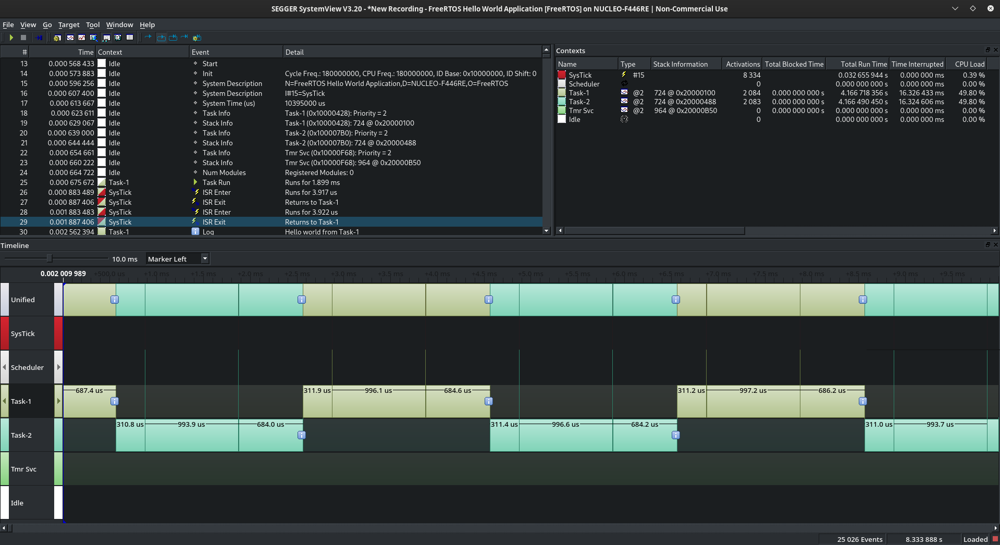
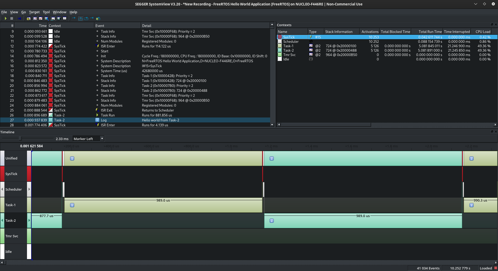

# 001 Tasks

In this project two tasks are implemented, task-1 and task-2. The objective is to be able to observe the difference between an pre-emptive and a cooperative scheduling.  
- If you set ```configUSE_PREEMPTION``` in [FreeRTOSConfig.h](cfg/FreeRTOSConfig.h) to 0, you are selecting the cooperative scheduling. In this case the scheduler is not called when the SysTick timer interrupt, configured with the frequency sepecified in the ```configTICK_RATE_HZ``` ([FreeRTOSConfig.h](cfg/FreeRTOSConfig.h)), rises. As the scheduler is not called, when a task finishes, it needs to request a context switch to another task calling the ```taskYIELD``` function.  
You can see an example of this scheduler in the image below:



- If you set ```configUSE_PREEMPTION``` in [FreeRTOSConfig.h](cfg/FreeRTOSConfig.h) to 1, you are selecting the pre-emptive scheduling. In this case the scheduler is called when the SysTick timer interrupt happens (in this case the function ```taskYIELD``` is not used). If the tasks are set with the same priority level, a Round-Robin mechanism is applied, and the tasks are executed in a cyclic way.  
You can see an example of this scheduler in the image below, where task-1 and task-2 are configured with the same priority level:


