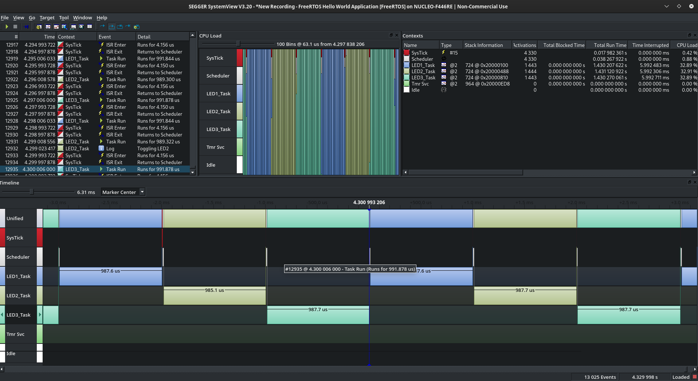
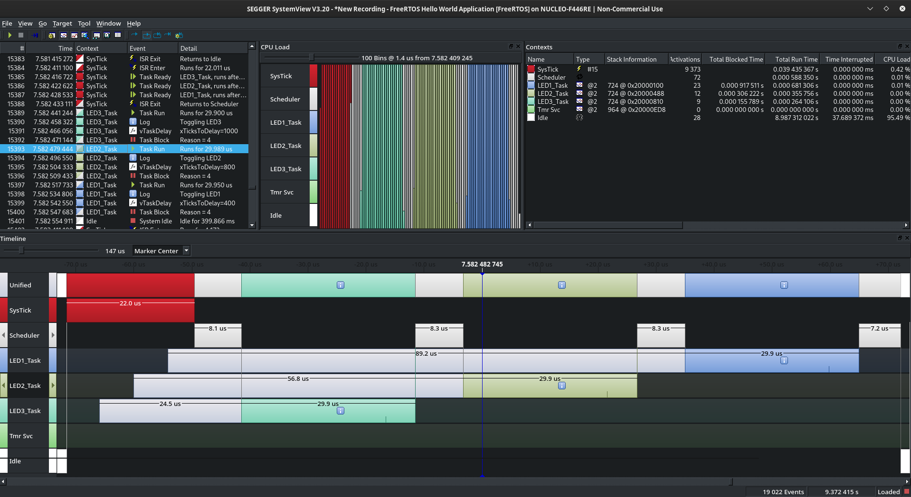
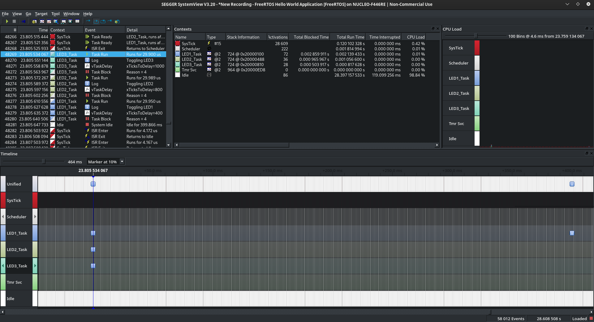

# 002 LEDs

In this project three tasks are scheduled. Each task controls an LED, toggling this LED periodically (400, 800 and 1000ms periodic cycle). The idea here is to use the ```xTaskDelay``` and ```xTaskDelayUntil``` APIs to free the CPU.  
For testing this project you need to follow the connection diagram below:


If you use the Delay function (which basically is implementing a for loop) for waiting in each task, you will see the CPU is blocked in that task and will not be free anytime. You can see this behaviour below where the CPU Load is distributed between the three LED tasks:



The code for the tasks is as follow:
```c
static void LED1_handler(void* parameters){

    for(;;){
        SEGGER_SYSVIEW_PrintfTarget("Toggling LED1");
        GPIO_ToggleOutputPin(GPIOC, GPIO_PIN_NO_5);
        Delay(400);
    }
}

```

If you use the ```vTaskDelay``` function for waiting in each task, you will see the CPU is not blocked in that task and the most of the time the idle task is being executed. YOu can see this behaviour in the two pictures below:





The code for the tasks is as follow:
```c
static void LED1_handler(void* parameters){

    for(;;){
        SEGGER_SYSVIEW_PrintfTarget("Toggling LED1");
        GPIO_ToggleOutputPin(GPIOC, GPIO_PIN_NO_5);
        vTaskDelay(pdMS_TO_TICKS(400));
    }
}
```

You can also use the ```vTaskDelayUntil``` where the task is waiting for an absolute amount of time and not a relative one, but for this particular example you will not notice any difference.
