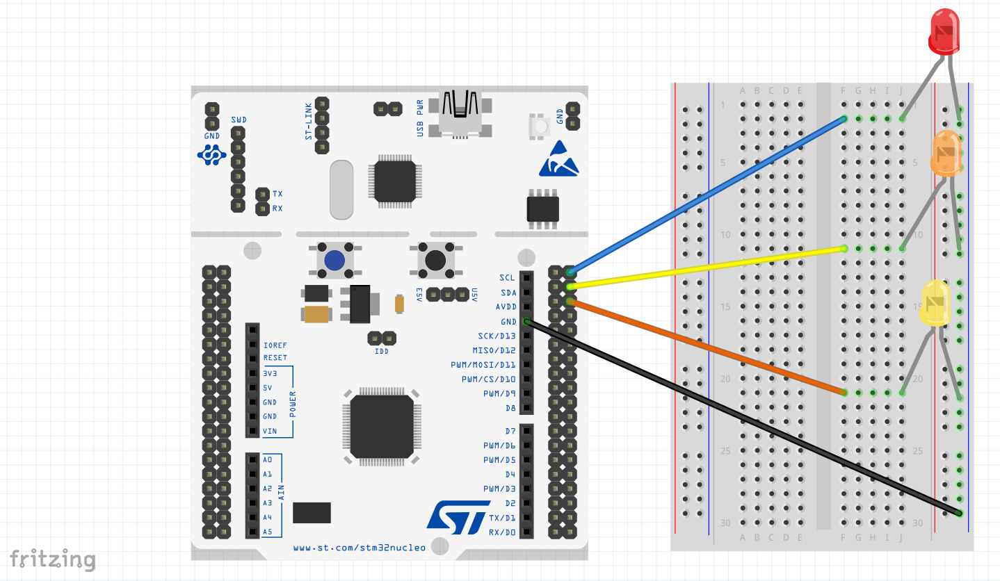

# 003 LEDs Notify

In this project four tasks are scheduled. Three of these tasks control three LEDs (each tasks controls one LED), toggling each LED periodically (400, 800 and 1000ms periodic cycle). The fourth task controls the input of a button, when this button is pressed an LED is set to ON and it does not blink anymore (if you press the button three times all the LEDs are set to ON).  
The purpose of this example is to use the notification process between tasks (using ```xTaskNotifyWait``` API from freeRTOS), the free of memory deleting an unused task (using ```vTaskDelete``` API from freeRTOS) and the prevention of modifying shared resources suspending the scheduler (using ```vTaskSuspendAll``` and ```xTaskResumeAll``` APIs from freeRTOS).

For testing this project you need to follow the connection diagram below:



If you use the SEGGER Systemview for debugging or inspecting the tasks behaviour you will see something similar to the images below:

- Here you can observe when the button is pressed, the LED task is deleted (first task for LED1, next is task for LED2 and finally task for LED3 and the task for the button).


- A more detailed view of the pressed button event is showed here. When this event happens, the button task sends a notification to the LED task (in this case the LED1 task) and then, the scheduler pass the control to the LED task, this task deletes itself and the idle task comes into picture.


