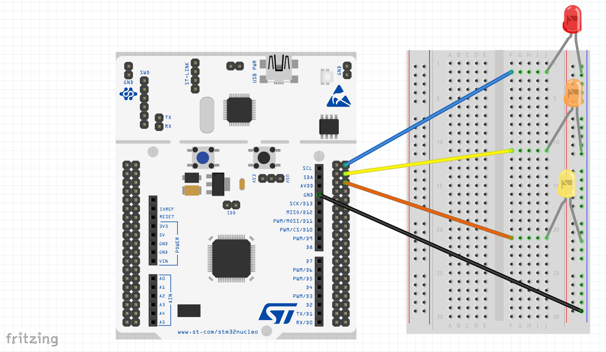
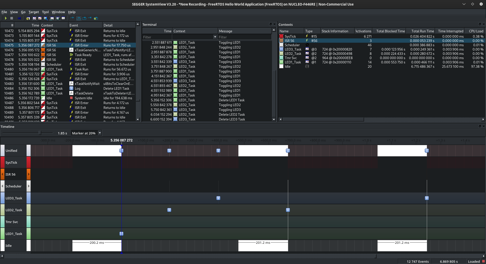
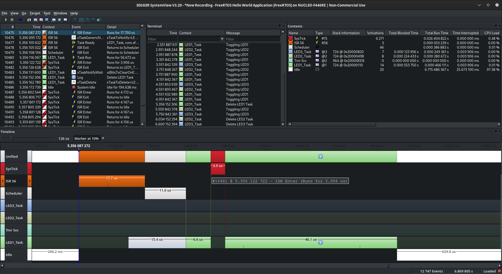

# 004 LEDs Notify ISR

In this project three tasks are scheduled for controlling three LEDs (each tasks controls one LED), toggling each LED periodically (400, 800 and 1000ms periodic cycle). The input of a button is configured as an interruption routine, when this button is pressed an LED is set to ON and it does not blink anymore (if you press the button three times all the LEDs are set to ON).   
The purpose of this example is to use the APIs provided by the freeRTOS regarding the interruption contex, in this case ```xTaskNotifyFromISR``` and ```portYIELD_FROM_ISR```. Since I am using the SEGGER Systemview for debugging, I need to use ```traceISR_ENTER``` and ```traceISR_EXIT``` for tracing the ISR.

For testing this project you need to follow the connection diagram below:



If you use the SEGGER Systemview for debugging or inspecting the tasks behaviour you will see something similar to the images below:

- Here you can observe when the button is pressed the ISR comes into picture and the LED task is deleted (first task for LED1, next is task for LED2 and finally task for LED3), you can observe there is no a task for managing the button, because the button is now managed using a ISR (ISR56).



- A more detailed view of the pressed button event is showed here. When this event happens, the interruption routine is scheduled and sends a notification to the LED task (in this case the LED1 task) and then, the scheduler pass the control to the LED task, this task deletes itself and the idle task comes into picture.


