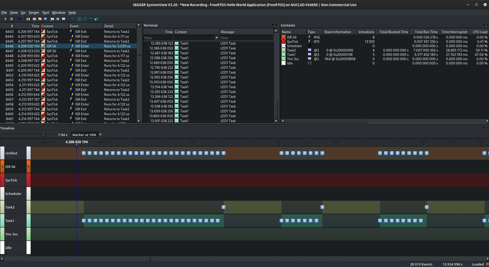

# 005 Task Priority

In this project two tasks are scheduled for controlling one LED. The taks 1 toggles the LED each 100ms and the task 2 each 1000ms. The tasks are configured with different priority, so task 2 has a higher priority than task 1 (this means the task 2 will be the only task executing by the OS).  
On the other hand an input signal from a button is configured using an interruption routine. When the ISR regarding the button touch is executed, the priority of the tasks is switched. So each time you press the button, the LED changes its frequency of blinking (between 100ms and 1000ms).  
The purpose of this project is to use the ```uxTaskPriorityGet``` and ```vTaskPrioritySet``` APIs provided by the freeRTOS and to experiment with the priority of different tasks and the management of the OS when these priorities change.

Since the used LED and button are built in the nucleo board, you don't need to follow any connection diagram for testing this example.

If you use the SEGGER Systemview for debugging or inspecting the tasks behaviour you will see something similar to the image below:



If you watch the code, you realise the ISR activates a flag for changing the priority (```status_button```). And the priority switching is done when a task is executed. That is the reason why a delay exists between the execution of the ISR and the change in the task executed by the OS.  
Notice a delay using a blocking loop as a for is needed, if you use the ```vTaskDelay``` API, the scheduler will run the task with less priority after calling this API and you do not get the desired behaviour.
