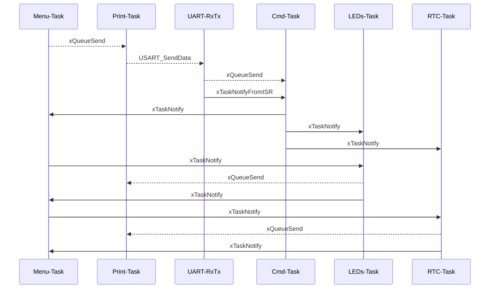
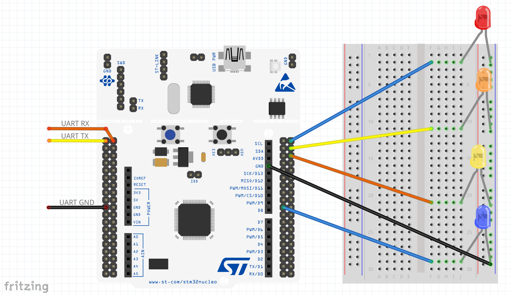

# 006 Queues

In this project five tasks are scheduled for managing four LEDs and the RTC peripheral of the microcontroller:
- Menu-Task: for managing the main menu of the application. The menu appears in a terminal as follows:

  ```console
  ========================
  |         Menu         |
  ========================
  LED effect    ----> 0
  Date and time ----> 1
  Exit          ----> 2
  Enter your choice here :
  ```
- Print-Task: for managing the printing process, the output is the UART3 peripheral (PC10).
- Cmd-Task: for managing the input commands, the input is the UART3 peripheral (PC11).
- LED-Task: for managing the LEDs behaviour. The menu appears in a terminal as follows:  

  ```console
  ========================
  |      LED Effect      |
  ========================
  (none,e1,e2,e3,e4)
  Enter your choice here :
  ```
- Rtc-Task: for managing the RTC peripheral. The menu appears in a termninal as follows:

  ```console
  ========================
  |         RTC          |
  ========================

  Current Time&Date:      12:00:02 [AM]
                          99-01-01
  Configure Time            ----> 0
  Configure Date            ----> 1
  Enable reporting          ----> 2
  Exit                      ----> 3
  Enter your choice here : 
  ```

The objective of this example is the usage of the queues as communication method between tasks. So functions as ```xQueueCreate```, ```xQueueSend```, ```xQueueSendFromISR```, ```xQueueReceive```, ```xQueueReceiveFromISR``` and other functions related with queues are used. Also software timers are used, you can see functios as ```xTimerCreate```, ```xTimerStart```, ```xTimerStop``` or ```xTimerIsTimerActive``` in the code for managing time.

For a better understanding of this example, you can find here a diagram about the tasks and the communications:


## Testing

For testing this project you need to follow the connection diagram below:



You can use minicom software to open a terminal (use the tty device corresponding to your UART port):
```console
sudo minicom -D /dev/ttyUSB0
```
In order to watch the data in the right way you must enable ```Add Carriage Ret...U``` and ```local Echo on/off..E``` in the configuration menu (press Ctrl-A Z for entering in this menu).
